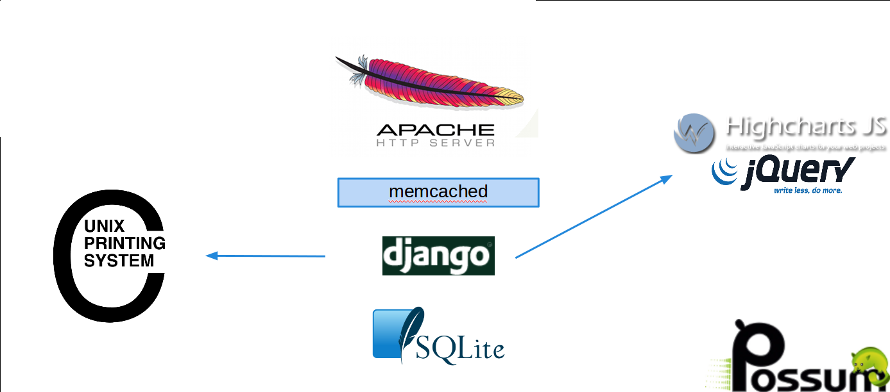

Installation
============

Cette documentation est écrite pour Debian, et devrait fonctionner avec toutes les distributions (Ubuntu, Gentoo, ...).

Voici le schéma général des différentes briques logiciels:

Possum
------

Vous avez ici 2 possibilités, dans tous les cas, il faudra se positionner dans un répertoire.
Prenons le répertoire **/opt**:

::

  cd /opt

Soit télécharger la dernière version
stable de POSSUM ici: `GitHub <https://github.com/possum-software/possum/archives/master>`_

::

  tar xzf possum-software-possum-*.tar.gz

Soit utiliser la version en développement:

::

  git clone https://github.com/possum-software/possum.git possum-software

Remarque: il est recommandé d'utiliser la dernière version stable.

Prérequis
---------

Possum nécessite l'installation de quelques paquets, pour simplifier l'installation
il suffit d'utiliser la commande **./make** dans le répertoire de Possum:

::

  # il faut les droits root pour cette commande
  ./make deb_install

Ensuite pour l'installation ou les mises à jours, nous allons encore utiliser la
commande **./make**:

::

  ./make update

Cette opération va installer et configurer tout l'environnement virtuel nécessaire
à Possum.

Il nous reste maintenant à initialiser les données, pour cela il est recommandé
de copier le fichier d'initialisation **possum/utils/init_db.py**. Pour un exemple
plus complet, vous pouvez vous inspirer du fichier **possum/utils/init_demo.py**:

::

  cp possum/utils/init_db.py possum/utils/init_mine.py
  # adapt file possum/utils/init_mine.py and run it:
  ./make init_mine

Impression
----------

Possum peut imprimer sur plusieurs imprimantes. Afin de pouvoir les utiliser, il faut avoir
un serveur cups configurer sur le serveur. Vous pouvez vérifier que les imprimantes sont bien
disponibles avec la commande:

::

  lpstat -v

Vous pouvez configurer le serveur d'impression via une interface web, en général à l'adresse
suivante: `Cups <http://localhost:631>`_

D'autre part, l'impression des tickets nécessite la création et la suppression de nombreux
fichiers. Je vous recommande donc d'utiliser un système de fichier virtuel type tmpfs pour
le répertoire **tickets** qui se trouve par défaut dans le répertoire **possum-software**.

Par exemple, si le chemin absolu vers votre répertoire **tickets** est 
**/opt/possum-software/tickets/**, il faudra ajouter la ligne suivante dans votre 
fichier **/etc/fstab**:

::

  tmpfs /opt/possum-software/tickets/ tmpfs defaults,nodev,nosuid 0 0

Cela peut être fait avec les commandes suivantes (en étant root):

::

  echo "tmpfs /opt/possum-software/tickets/ tmpfs defaults,nodev,nosuid 0 0" >> /etc/fstab
  mount /opt/possum-software/tickets/

Le dernière commande donne les droits sur le répertoire au serveur web Apache.

Documentation
-------------

Vous pouvez générer la documentation en html avec la commande suivante:

::

  ./make doc

Elle sera disponible ici: **/opt/possum-software/doc/_build/html/**.

Sinon elle est également disponible sur le site officiel: `Documentation <http://www.possum-software.org>`_.

Configuration du serveur Web
----------------------------

Nous avons besoin maintenant d'un serveur web. Il y a plusieurs possibilités,
celle-ci se base sur le serveur web `Apache <http://httpd.apache.org/>`_.

Si vous préférez `NGinx <http://nginx.org/>`_, il y a un document d'installation dédié ici:

.. install_nginx

En bref, le module `mod_wsgi <http://code.google.com/p/modwsgi/>`_ servira à exécuter Possum.

Commençons par installer les paquets nécessaires:

::

  ./make deb_install_apache

Il reste la configuration à faire. Pour cela, il y a des configurations type dans 
le répertoire **possum/utils/**.

Par exemple, pour une configuration standard et sécurisée:

::

  cp possum/utils/apache2-ssl.conf /etc/apache2/sites-available/possum.conf

Il faudra modifier le fichier **/etc/apache2/sites-available/possum.conf**
pour l'adapter à votre installation, puis:

::

  a2ensite possum
  /etc/init.d/apache2 restart

La configuration conseillée utilise du **https** afin
de sécuriser les échanges entre les clients et le serveur. Pour utiliser 
cette configuration, le 
fichier **/etc/hosts** doit être correctement configuré. 

Exemple:

::

  # hostname
  possum

Ici, le serveur s'appelle **possum**.

::

  # on donne les droits nécessaires au serveur web sur le répertoire
  # possum-software
  chown -R www-data /opt/possum-software
  # création des certificats SSL
  make-ssl-cert generate-default-snakeoil --force-overwrite

Mail
----

Il est préférable d'avoir un serveur de mail configurer sur le poste. En
effet, POSSUM peut envoyé des messages s'il y a des tentatives d'accès
au panneau d'administration ou des bugs.

::

  sudo apt-get install postfix bsd-mailx

  Configuration type du serveur de messagerie: Site Internet
  Nom de courrier : possum (ou le nom que vous voulez)

Il est conseillé de définir un alias pour l'utilisateur root dans le fichier 
**/etc/aliases**. Dans ce cas, vous aurez une ligne du type:

::

  root: votre_adresse@possum-software.org

Cet alias vous permettra de recevoir les éventuelles alertes du système d'exploitation.
Après chaque modification de ce fichier, il faut lancer la commande:

::

  sudo newaliases

Si tout est bien configurer, vous devriez recevoir un mail avec comme
sujet **test** et dans le message la date d'envoie en utilisant la
commande suivante:

::

  date | mail -s test root

L'installation est presque terminée, vous devez maintenant configurer
la sauvegarde automatique de la base de données. Cette partie dépend du
type de base que vous avez choisi. La plus simple étant la base sqlite,
sa sauvegarde se limite à la copie d'un fichier.

Pour accéder à POSSUM, il suffit de lancer un navigateur web.

